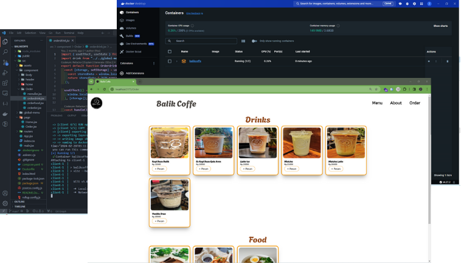

# Docker Ex Machina



this project i build for learning basic docker and configuration docker purposes,

so this is my first project run inside my virtual machine 🐳🐳🐳🐳

<br>

## about web app:

### Balik Coffe

just simple homepage and order page for coffe shop.

<h4>build with :</h4>

<p align="start">
  <a href="https://skillicons.dev">
     
  </a>
  <p>inside :</p>
  <a href="https://skillicons.dev">
     
  </a>
</p>

<br>

## Thanks for seeing

### Dont forget to :

```bash
 npm install
```

Follow me :
<br>

[](https://www.linkedin.com/in/asrarizikran/) [](https://www.instagram.com/don_zikii/)
